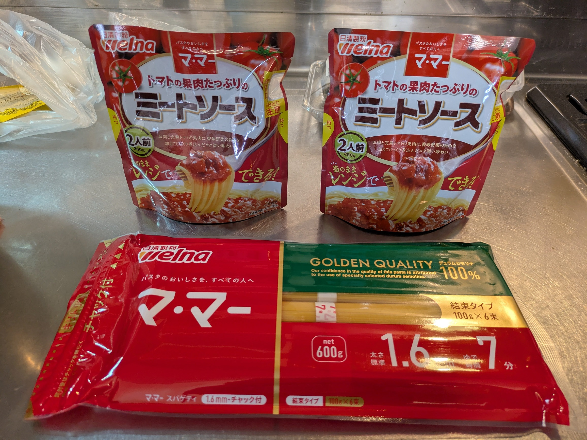

# スパゲッティ(レトルト)メモ

## 食材
日清製粉の「マ·マー」を使う。

- 麺：4人で4束 (これで十分)
- 水：2.5Lほど。鍋に入るのがここまでなので。
- 塩：水の量に合わせる。ティースプーンすりきり1杯＝小さじ1杯。
- 調理済みベーコン

## 作るときのメモ
**ソースはレンジで温めない。**

麺をゆでて湯切りした後、鍋に戻してソースを混ぜていためる。  
いためるタイミングで調理済ベーコンも入れると美味しい。
