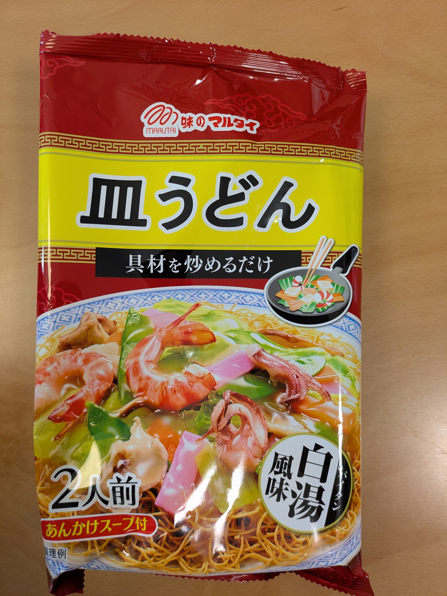
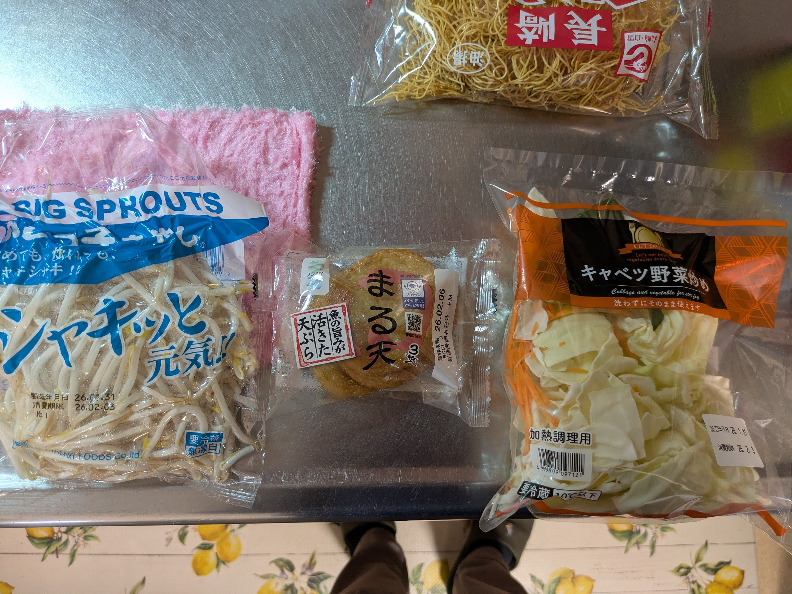

# 皿うどんメモ

## 食材
- 麺：「味のマルタイ」

- 油：多めに。大さじ4杯以上はほしい。

具材の組み合わせはお好みで。以下2パターン。
- 具材パターン1
  - もやし：1袋
  - カット野菜：1袋
  - ウインナー：8本ぐらい 半分にカット
  - 丸天：4枚ぐらい 1/4にカット

以下のような感じ。

- 具材パターン2  
この場合、卵→もやし→かまぼこの順にいためる。
  - 卵：3個
  - もやし：1袋
  - かまぼこ 細めにカット

## 作るときのメモ
特に無し。パッケージの通りに作る。
